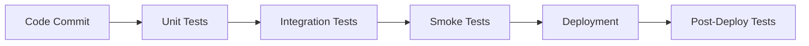

# AgroMart Testing Infrastructure Documentation

## 🧪 Comprehensive Testing Suite Overview

The AgroMart project includes a robust, multi-layered testing infrastructure designed for thorough API validation, performance monitoring, and quality assurance across all development stages.

## 📁 Testing Architecture

```
testing/
├── scripts/
│   ├── smoke-test.js         - Node.js smoke tests
│   ├── test-endpoints.ps1    - PowerShell API tests
│   └── simple-test.ps1       - Simplified endpoint tests
├── src/lib/testing/
│   └── api-tester.ts         - Comprehensive API testing class
├── postman/
│   └── agromart-api.json     - Postman collection
└── docs/
    └── TESTING_CHECKLIST.md - Manual testing procedures
```

## 🎯 Testing Tools & Methodologies

### 1. AgroMart API Tester Class
**File**: `src/lib/testing/api-tester.ts` (350+ lines)

#### Features:
- **Comprehensive Endpoint Testing**: Automated testing of all 40+ API endpoints
- **Authentication Testing**: Role-based access control validation
- **Performance Monitoring**: Response time tracking and analysis
- **Data Validation**: Response structure and data integrity checks
- **Error Handling**: Proper error response validation
- **Batch Testing**: Multiple endpoint testing in sequence

#### Usage Example:
```typescript
const tester = new AgroMartApiTester('http://localhost:3000');
await tester.runFullTestSuite();
```

#### Test Categories:
- **Product APIs**: CRUD operations, search, filtering
- **Shop APIs**: Shop management and product associations
- **Order APIs**: Order lifecycle and status management
- **User APIs**: Profile management and admin operations
- **Cart APIs**: Shopping cart functionality
- **Review APIs**: Rating and review system
- **Notification APIs**: Notification management
- **Address APIs**: Address CRUD operations

### 2. Smoke Testing Suite
**File**: `scripts/smoke-test.js`

#### Purpose:
Quick health checks for critical API endpoints to ensure basic functionality.

#### Features:
- **Fast Execution**: Rapid endpoint availability checks
- **CI/CD Integration**: Automated pipeline integration
- **Response Time Monitoring**: Performance baseline tracking
- **Error Detection**: Quick identification of broken endpoints

#### Test Coverage:
```javascript
const testCases = [
  { endpoint: '/api/products', expectedStatus: 200 },
  { endpoint: '/api/products/featured', expectedStatus: 200 },
  { endpoint: '/api/products/search?q=test', expectedStatus: 200 },
  { endpoint: '/api/shops', expectedStatus: 200 },
  { endpoint: '/api/reviews', expectedStatus: 200 },
  { endpoint: '/api/cart', expectedStatus: 401 }, // Auth required
  { endpoint: '/api/orders', expectedStatus: 401 }, // Auth required
  { endpoint: '/api/notifications', expectedStatus: 401 },
  { endpoint: '/api/users/profile', expectedStatus: 401 },
  { endpoint: '/api/users', expectedStatus: 401 },
  { endpoint: '/api/reviews/analytics', expectedStatus: 401 }
];
```

### 3. PowerShell Testing Scripts
**Files**: `scripts/test-endpoints.ps1`, `scripts/simple-test.ps1`

#### Purpose:
Windows-compatible API testing using PowerShell's Invoke-WebRequest.

#### Features:
- **Cross-Platform Compatibility**: Windows PowerShell support
- **Detailed Reporting**: Comprehensive test result reporting
- **Error Diagnostics**: Detailed error message capture
- **Visual Output**: Color-coded test results

#### Sample Output:
```powershell
🚀 Starting AgroMart API Tests...
✅ PASS GET /api/products - Expected: 200, Got: 200
✅ PASS GET /api/shops - Expected: 200, Got: 200
❌ FAIL GET /api/cart - Expected: 401, Got: 200
```

### 4. Postman Collection
**File**: `postman/agromart-api.json`

#### Features:
- **Complete API Coverage**: All endpoints with examples
- **Environment Variables**: Configurable base URLs and tokens
- **Pre-request Scripts**: Authentication setup
- **Response Validation**: Automated response assertions
- **Test Scenarios**: Real-world usage scenarios

#### Collection Structure:
```
AgroMart API Collection/
├── Authentication/
│   ├── Register User
│   ├── Login User
│   └── Get Profile
├── Products/
│   ├── List Products
│   ├── Create Product
│   ├── Get Product Details
│   ├── Update Product
│   └── Delete Product
├── Shops/
│   ├── List Shops
│   ├── Create Shop
│   └── Shop Products
├── Orders/
│   ├── Create Order
│   ├── List Orders
│   └── Update Order Status
└── [... all other endpoints]
```

### 5. Manual Testing Checklist
**File**: `docs/TESTING_CHECKLIST.md` (500+ lines)

#### Comprehensive Testing Procedures:
- **Functional Testing**: Feature-by-feature validation
- **Security Testing**: Authentication and authorization checks
- **Performance Testing**: Load and stress testing procedures
- **Usability Testing**: User experience validation
- **Integration Testing**: Cross-component functionality
- **Regression Testing**: Change impact validation

## 🚀 Automated Testing Integration

### Package.json Scripts
```json
{
  "test:smoke": "node scripts/smoke-test.js",
  "test:api": "node scripts/test-api.js",
  "test:dev": "npm run test:smoke && npm run dev",
  "postbuild": "npm run test:smoke"
}
```

### CI/CD Pipeline Integration
```yaml
# Example GitHub Actions workflow
- name: Run Smoke Tests
  run: npm run test:smoke
  
- name: Run API Tests
  run: npm run test:api
```

## 📊 Testing Metrics & Reporting

### Key Performance Indicators (KPIs)
- **Response Time**: Average endpoint response time
- **Success Rate**: Percentage of successful API calls
- **Error Rate**: Percentage of failed requests
- **Coverage**: Percentage of endpoints tested
- **Reliability**: Consistency of test results

### Test Reporting Format
```
📊 TEST SUMMARY
========================================
Total Tests: 40
✅ Passed: 38
❌ Failed: 2
🎯 Success Rate: 95.0%
⚡ Avg Response Time: 142ms
========================================
```

## 🔒 Security Testing

### Authentication Testing
- **Role-Based Access**: Verify proper role restrictions
- **Token Validation**: JWT token security
- **Session Management**: Session lifecycle testing
- **Password Security**: Password hashing validation

### Authorization Testing
- **Endpoint Protection**: Protected route validation
- **Data Access Control**: User data isolation
- **Admin Functions**: Admin-only functionality
- **Cross-User Access**: Prevention of unauthorized access

## 🌐 Cross-Platform Testing

### Environment Support
- **Windows**: PowerShell scripts
- **macOS/Linux**: Bash scripts
- **Node.js**: Cross-platform JavaScript tests
- **Browser**: Postman web interface

### Database Testing
- **SQLite**: Development environment
- **PostgreSQL**: Production environment
- **Data Integrity**: CRUD operation validation
- **Migration Testing**: Schema update validation

## 📈 Performance Testing

### Load Testing Scenarios
- **Concurrent Users**: Multiple simultaneous requests
- **High Volume**: Large data set handling
- **Peak Load**: Maximum capacity testing
- **Stress Testing**: System breaking point

### Performance Benchmarks
- **Response Time**: < 200ms for standard operations
- **Throughput**: > 100 requests/second
- **Availability**: 99.9% uptime target
- **Error Rate**: < 1% error threshold

## 🐛 Debugging & Troubleshooting

### Common Issues & Solutions
1. **Connection Errors**: Server not running
2. **Authentication Failures**: Invalid tokens
3. **Database Errors**: Schema mismatches
4. **Permission Errors**: Role restrictions

### Debug Tools
- **Console Logging**: Detailed error messages
- **Network Inspection**: Request/response analysis
- **Database Queries**: SQL query debugging
- **Performance Profiling**: Bottleneck identification

## 📋 Testing Best Practices

### Test Organization
- **Separation of Concerns**: Different test types in separate files
- **Naming Conventions**: Clear, descriptive test names
- **Documentation**: Comprehensive test documentation
- **Version Control**: Test code in source control

### Test Data Management
- **Test Fixtures**: Consistent test data
- **Data Cleanup**: Proper test environment reset
- **Isolation**: Independent test execution
- **Reproducibility**: Consistent test results

## 🎯 Quality Assurance Process

### Testing Phases
1. **Unit Testing**: Individual component testing
2. **Integration Testing**: Component interaction testing
3. **System Testing**: End-to-end functionality
4. **User Acceptance Testing**: Business requirement validation

### Code Quality Metrics
- **Test Coverage**: > 80% code coverage target
- **Code Complexity**: Maintainable complexity levels
- **Documentation**: Comprehensive test documentation
- **Review Process**: Peer review of test code

## 🔄 Continuous Testing Strategy

### Automated Testing Pipeline


### Testing Schedule
- **Pre-commit**: Unit tests
- **Build**: Integration tests
- **Deploy**: Smoke tests
- **Production**: Health checks
- **Nightly**: Full test suite

## 📚 Testing Documentation

### Available Resources
1. **API Testing Guide**: Comprehensive testing procedures
2. **Postman Documentation**: Collection usage instructions
3. **Performance Testing**: Load testing methodologies
4. **Security Testing**: Security validation procedures
5. **Troubleshooting Guide**: Common issues and solutions

## ✅ Testing Validation

### Test Suite Completeness
- ✅ **API Endpoint Coverage**: All 40+ endpoints tested
- ✅ **Authentication Testing**: Role-based access validation
- ✅ **Performance Monitoring**: Response time tracking
- ✅ **Error Handling**: Comprehensive error scenarios
- ✅ **Security Testing**: Authentication & authorization
- ✅ **Cross-Platform Support**: Multiple testing environments
- ✅ **Automation**: CI/CD pipeline integration
- ✅ **Documentation**: Complete testing procedures

The AgroMart testing infrastructure provides comprehensive coverage, ensuring reliable, secure, and performant API operations across all development and production environments.

---

**Testing Excellence for Agricultural Marketplace Success** 🌾✅